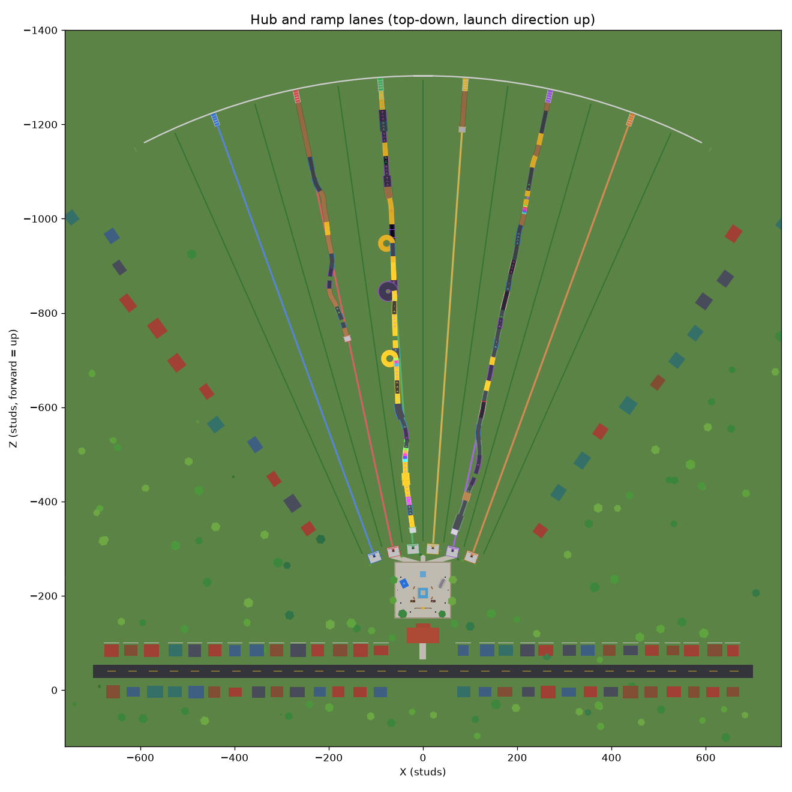
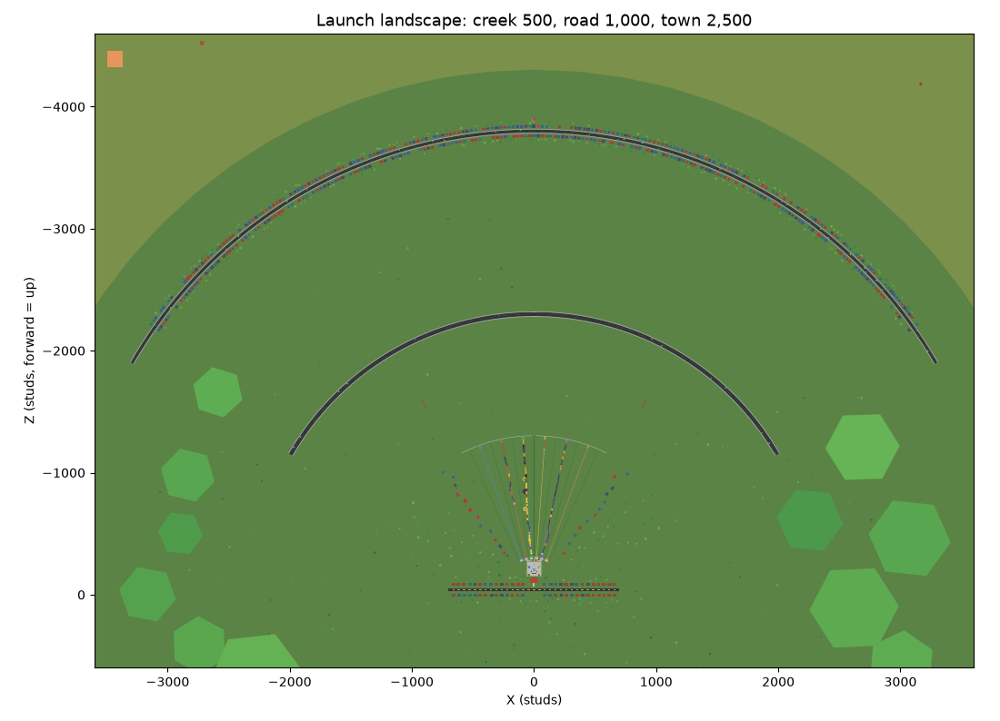
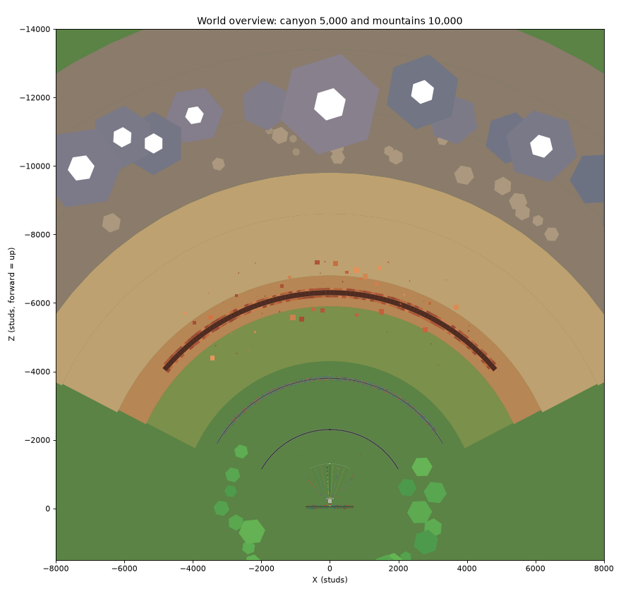
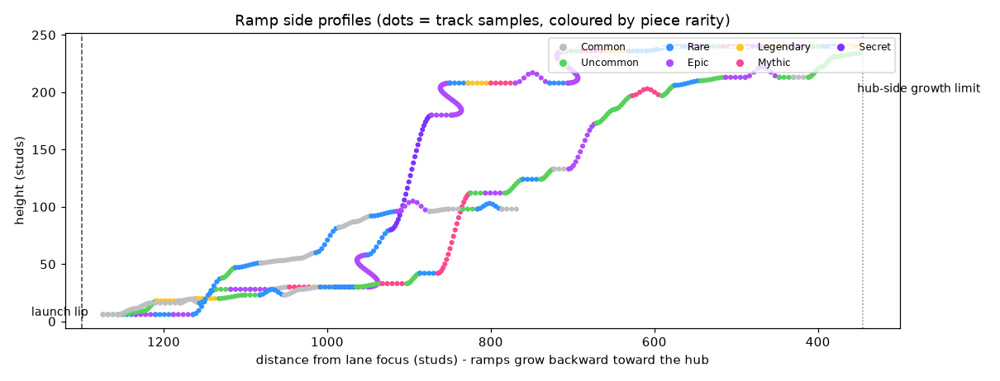

# Grow a Ramp

A Roblox progression game: **your ramp keeps growing (even while you're offline), you get lucky with
insane track pieces, ride down it faster and faster, and launch farther than everyone else.**

The one objective is **GO FARTHER**.



> These images are top-down renders of the *actual* baked world and generated ramps (exported from
> the real builders), not concept art. See [Previews](#previews).

---

## Open it in Roblox Studio

**Option A: ready-made place file (no tools needed)**

1. Open `build/GrowARamp.rbxl` in Roblox Studio.
2. **File → Game Settings → Security → Enable Studio Access to API Services** (needed for saving).
   Without it the game still runs, using in-memory data, and shows a "Studio test mode" notice.
3. Press **Play**. On first run the terrain (grass, creek water) is generated. To keep it baked in,
   run this in the command bar (edit mode) and save:
   `require(game.ServerScriptService.Server.World.WorldBuilder).Build()`

**Option B: live sync with Rojo (recommended for development)**

1. Install [Rojo](https://rojo.space) 7.x and its Studio plugin.
2. `rojo serve` in this folder, then connect from the plugin in an empty Baseplate.
3. Press Play. The world builds procedurally on server start (a few seconds). Bake it with the
   command above.

**Before publishing:** set **Max Players = 6** (one lane per player) in Game Settings → Places.

### Controls

| Action | Desktop | Mobile / console |
|---|---|---|
| Ride | walk to your cart, press **E** ("Enter Cart") | tap the prompt |
| Upgrades / Ramp / Worlds | top-right buttons, or the hub stations | same |

Everything else is automatic: forward movement, the lift to the top, the launch and the return.

### Studio test commands (Studio only)

`/money 100000`, `/grow 20`, `/luck 15`, `/event Luck10x` (or `DoubleGrowth`, `GoldenRush`,
`MutationStorm`, `SecretSurge`, `stop`), `/offline 120` (simulate 2 h away), `/reset`.

---

## How it plays

```
RAMP GROWS → NEW PIECES REVEALED → RIDE → +SPEED → SPECIAL PIECES → LAUNCH → DISTANCE → CASH → UPGRADE → REPEAT
```

* **First minute:** spawn → "RIDE YOUR RAMP" → a 4-piece starter ramp → ~250 studs → $62 →
  "UPGRADE YOUR RAMP" → the next piece is fast-forwarded (`NEXT PIECE 00:05`) → ride again and beat it.
* **Growth:** a new piece rolls every 20 s (Growth Speed upgrades shorten this). Offline growth
  continues at 60% speed up to the Offline Time cap (2 h → 24 h).
* **RNG:** 7 rarities (Common → Secret), 29 track pieces, 5 mutations (Golden, Giant, Rainbow,
  Glitched, Void). Odds shown in the Ramp menu are computed by the same code the server rolls with.
* **The ride:** +1 speed per normal piece, big boosts on special pieces, then a controlled launch.
  Distance = f(final speed, launchers). Reward = distance × multipliers from pieces/mutations/events.
* **Full ramp:** a lane holds about 35–45 pieces. After that, every roll *upgrades your weakest
  piece* (re-validating the whole ramp), or is scrapped for cash if it beats nothing.
* **Events** (every ~8–13 min, 90–150 s): 10X LUCK, DOUBLE GROWTH, GOLDEN RUSH, MUTATION STORM,
  SECRET SURGE.
* **Social:** every ramp is visible from the hub, lane signs show names + best distance, a hub
  leaderboard shows Farthest Launch / Longest Ramp / Rarest Piece, and Mythic/Secret rolls are
  announced server-wide.

### World layout

Six lanes fan out from behind the hub, so boarding pads sit 40–110 studs from spawn while the
launch lips spread out on **one shared launch line**. Ramps grow *backward and upward* from their
fixed lip toward the hub (riders take a lift cable up to the top). Because every lip is on the
same line, the landmarks are honest for every lane:

| Distance | Landmark |
|---|---|
| 500 | Creek |
| 1,000 | Road |
| 2,500 | Town (water tower) |
| 5,000 | Canyon |
| 10,000 | Mountain |

---

## Project structure

```
default.project.json        Rojo project (Lighting, Players, StarterPlayer settings included)
build/GrowARamp.rbxl        ready-to-open place: scripts + baked world parts
src/shared/  → ReplicatedStorage.Shared
  Config/        GameConfig, RarityConfig, EconomyConfig, OfflineConfig, RideConfig,
                 EventConfig, UIConfig (design tokens), AudioConfig
  Definitions/   TrackDefinitions (29 pieces), MutationDefinitions, UpgradeDefinitions, WorldDefinitions
  Logic/         TrackGeometry (sockets + path sampling), RampLayout (placement + validation),
                 RampGenerator (the roll algorithm), RarityRoller (odds), RideSim (ride plan),
                 Economy, OfflineGrowth, PieceCodec (save format), Format
  Net.luau, Util/Signal.luau
src/server/  → ServerScriptService.Server
  Main.server.luau            service bootstrap (Init → Start)
  Services/   PlayerDataService (session-locked DataStore), SessionService (join/leave ordering),
              WorldService, PlayerPlotService, RampService, OfflineGrowthService, RideService,
              EconomyService, UpgradeService, EventService, LeaderboardService,
              NotificationService, MetricsService, DebugService
  World/      WorldBuilder, Landscape, Hub, Lanes, Props, Builder, RampBuilder, CartBuilder
src/client/  → StarterPlayerScripts.Client
  Main.client.luau
  Controllers/ State, Audio, UI, Notification, Camera, Effects, Ride, Plot
  UI/          Kit (UI helpers), Hud, Menus, Overlays
ServerStorage.Assets/{TrackModels,CartModels,WorldAssets}   drop-in final art (see below)
tests/       Lune test harness + specs, balance simulator, preview exporter/renderer
tools/       build-place.luau (rojo build + bake world into the place)
```

Changes from the suggested structure, and why:

* **`SessionService`** sequences join/leave across services, so data is never saved over by
  defaults after a failed load, and no step races another.
* **Ride and launch** are one `RideService` plus the shared `RideSim`, because the launch is the
  last segment of one server-authoritative plan.
* **`RampGenerator`** lives in Shared, so the server, the tests and the balance simulator run
  identical generation code.

### Key technical decisions

* **Server-authoritative everything.** The server builds the ride plan (speed per piece, distance,
  reward) from its own data and pays at the planned landing time. The client only animates it.
  RNG, mutations, upgrades, offline growth and money are all server-side, and remotes are
  validated and rate-limited.
* **Guided ride, no free physics.** The cart is welded to the rider (massless, non-colliding,
  network-owned by the rider) and moved along the exact sampled track, so it can't derail.
  Riders go into a "Riders" collision group.
* **Standardised sockets.** Every piece enters and exits level, so any piece follows any other.
  Placement validates lane bounds, the height band, heading, and overlap against all other track.
  Steering variants (mirror, ±6–12° bend) keep ramps centred in their lane.
* **Saving.** Data is compact: piece strings like `Loop|Golden`, never Instances. UpdateAsync
  with session locks, retries, throttled autosave and a BindToClose flush. Offline growth uses
  server time only and guards against first-join, future, NaN and absurd timestamps. The absence
  is consumed immediately, so reconnecting can't double-count it.
* **Performance.** Rarity VFX only run near the camera, nothing in the world uses `.Touched`,
  ramps are capped (50 pieces per lane), and distant scenery is big, simple geometry.

---

## Configuration (all balance numbers live in `src/shared/Config`)

| What | Where |
|---|---|
| Rarity weights, luck curve, rarity visuals, scrap values | `RarityConfig.luau` |
| Pieces: geometry, speed gain, reward/launch bonuses, weights | `Definitions/TrackDefinitions.luau` |
| Mutation chances and bonuses | `Definitions/MutationDefinitions.luau` |
| Upgrade costs | `Definitions/UpgradeDefinitions.luau` |
| Upgrade effects, reward per stud | `EconomyConfig.luau` |
| Offline caps, efficiency | `OfflineConfig.luau` |
| Move speed, launch distance formula, flight, camera | `RideConfig.luau` |
| Events | `EventConfig.luau` |
| Lane layout, track rules, cap, DataStore settings | `GameConfig.luau` |
| UI colours, fonts, sizes, icons | `UIConfig.luau` |
| Sounds | `AudioConfig.luau` |

Balance snapshot from the simulator (`lune run tests/tools/simulate.luau 60 <seed>`):
first upgrade at 17 s, first Rare at 2–6 min, Creek at 2.3 min, Road at about 7 min, lane full at
about 9.5 min, first Legendary at 14–30 min, Town at 18–22 min. See
[docs/BALANCE.md](docs/BALANCE.md).

---

## Final art pipeline (replacing procedural visuals)

The world and ramps are procedural low-poly parts, so everything is playable now. To swap in
modelled assets:

* **Track pieces:** put a Model named after the piece id (e.g. `Loop`) in
  `ServerStorage.Assets.TrackModels`, with an Attachment named `Entry` at the entry socket (facing
  −Z, level). It replaces the procedural deck; supports and VFX still generate. Keep the path
  matching the piece's `Path` definition, because the ride follows the definition.
* **Cart:** a Model `DefaultCart` in `ServerStorage.Assets.CartModels` with a PrimaryPart at the
  track-contact point (facing −Z) and a `Seat` inside.
* **Icons:** set `Image` asset ids in `UIConfig.Icons` (for example, exported from Figma).
* **Sounds:** replace the built-in placeholder ids in `AudioConfig`.
* **Map:** bake the world (command above), then edit or replace props in Studio.

---

## Testing

Everything below runs headless (no Studio):

```bash
lune run tests/run.luau            # 65 tests
lune run tests/tools/simulate.luau # balance simulation
lune run tools/build-place.luau    # rebuild build/GrowARamp.rbxl
```

What the tests prove:

* **Geometry:** sockets level and aligned, loops invert correctly, frames are continuous, sample
  resolution is adequate.
* **Layout:** 120 random full ramps (luck ×1–9) with zero invalid placements, checked by an
  independent O(n²) pass. Rebuild from save reproduces exact positions; corrupt saves are
  repaired; full ramps upgrade correctly.
* **Odds:** Monte-Carlo rolls match displayed odds; luck never lowers "at least X" odds; Commons
  stay above 15% at max luck; event multipliers do what they say.
* **Ride sim:** a continuous timeline, speed equals the sum of gains, the first ride lands about
  250 studs and pays for an upgrade, long ramps are compressed to the max ride time, flight lands
  exactly at the planned distance from the lip.
* **Economy, offline growth, save codec, formatting, config integrity.**
* **Real-instance execution:** the world builder, every piece × mirror × mutation model (348),
  carts, lip, start platform, HUD, menus, overlays and notification cards are *executed* against
  Roblox's reflection database (via Lune). Invalid property names or types fail the test.

Static analysis: `luau-lsp analyze` against the official Roblox type definitions reports 0
errors, and `selene` reports 0. Formatting is StyLua.

**Not verifiable headless (needs a Studio playtest):** ride feel and camera, seat and network
ownership hand-off, DataStore behaviour on live servers, mobile layout on real devices, and
sound and VFX taste. Use the checklist in [docs/PLAYTEST.md](docs/PLAYTEST.md).

---

## Previews

| | |
|---|---|
|  |  |



Regenerate: `lune run tests/tools/export_preview.luau && python tests/tools/render_preview.py`.

---

## Status by phase

| Phase | Status |
|---|---|
| 1 Foundation: architecture, config, data model, plots, world, hub, lanes | ✅ built and tested |
| 2 Modular track generation: sockets, rarity, luck, validation, reconstruction | ✅ built and tested |
| 3 Ride: lift, +1 speed, boosts, loops, launch, live distance, landing, return | ✅ built; needs Studio playtest for feel |
| 4 Progression: cash, 4 upgrades, rarity feedback | ✅ built and tested |
| 5 Saving and offline: session-locked DataStore, offline growth, duplicate prevention | ✅ built; offline math tested |
| 6 UI: HUD, menus, notifications, onboarding, welcome back (mobile-first) | ✅ built (in code; Figma not reachable) |
| 7 Final art | ⏳ procedural low-poly placeholders; asset drop-in pipeline ready |
| 8 RNG expansion: Mythic, Secret, mutations, announcements | ✅ built and tested |
| 9 Events: 5 events | ✅ built and tested |
| 10 Polish: VFX, SFX hooks, camera, speed lines, reveals | ✅ first pass; placeholder sounds |
| Post-MVP: worlds, prestige, daily rewards, monetization | ⏳ hooks in place (`WorldDefinitions`, `Prestige` field); not built, by design |
